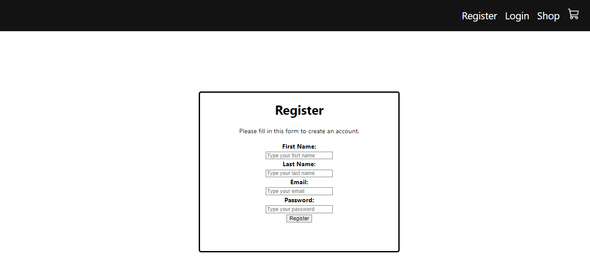
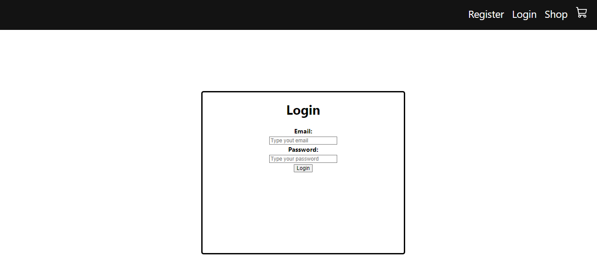
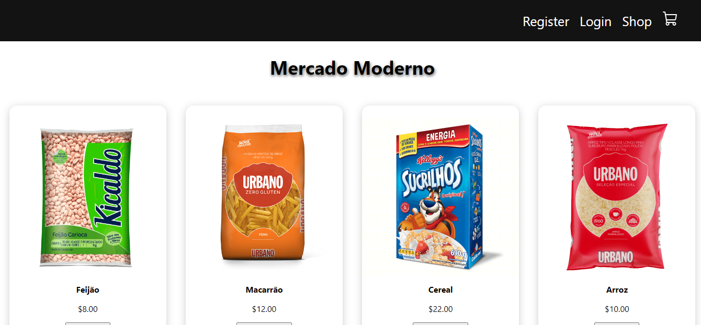
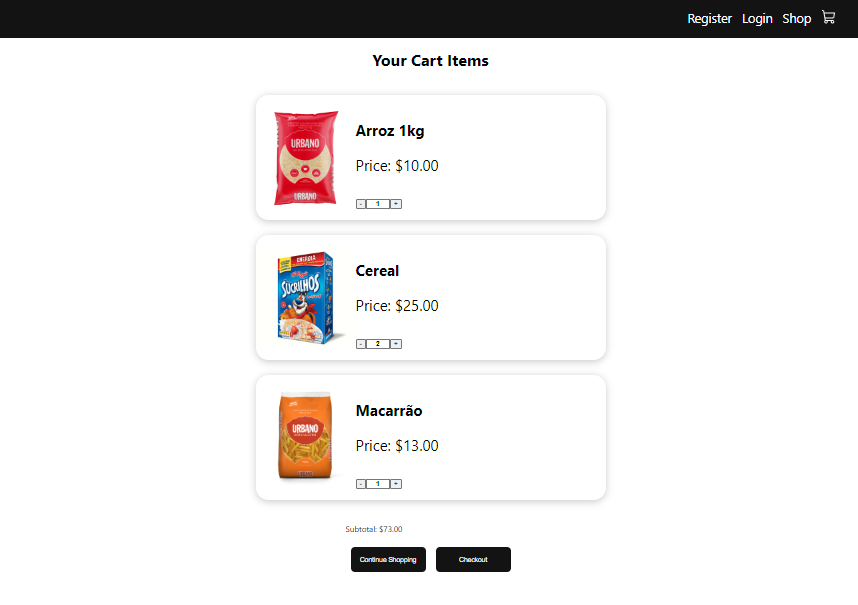
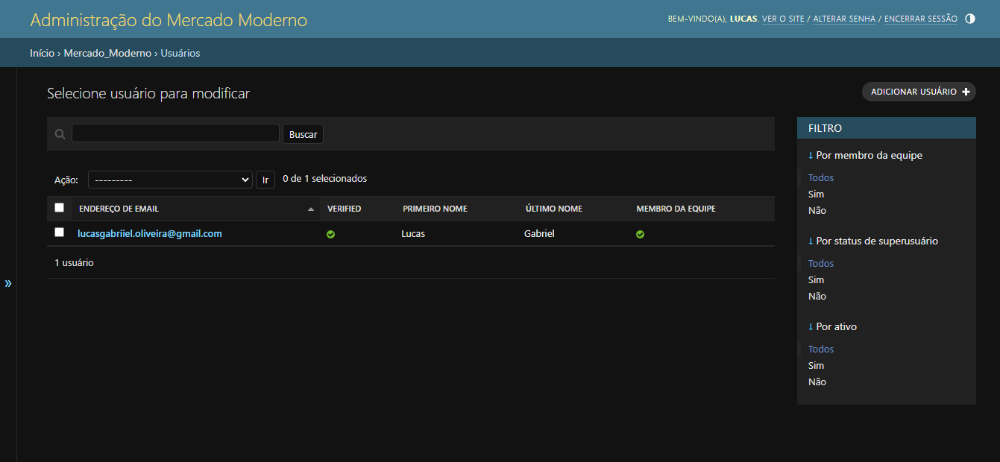
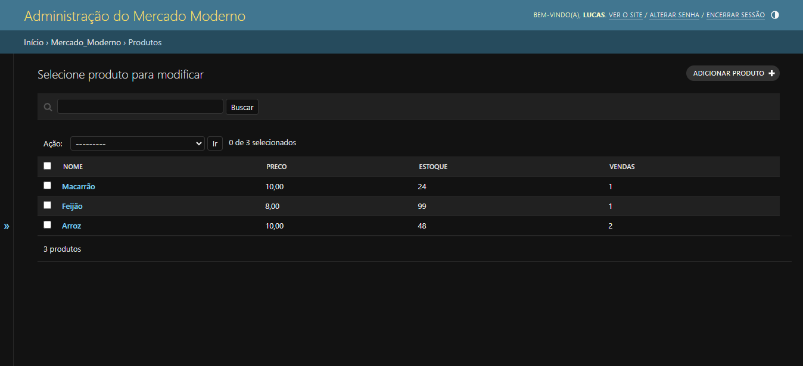

# :shopping: Mercado Moderno

O Mercado Moderno é uma aplicação Web de um mercado online, onde é possível configurar uma loja e cadastrar produtos para que outras pessoas possam fazer suas compras online.
Este é um projeto desenvolvido para a disciplina de Projeto Integrado, da Universidade Federal do Espírito Santo (<a href="ufes.br">UFES</a>)

### :hammer: Ferramentas Utilizadas

Essas são algumas das linguagens, ferramentas, frameworks e bibliotecas que utilizamos no desenvolvimento dessa aplicação:

* Python
* Django
* Node.js
* React
* HTML
* CSS
* JavaScript

## :wrench: Configurações Iniciais

Essas são as instruções iniciais para configurar o projeto localmente. 

### Pré-requisitos

Essas são as ferramentas necessárias que você vai precisar ter instaladas para rodar o projeto:
* python - v3.8
* node.js - v18.16.1
* npm - v9.7.2

## ⚙️ Instalação

Clone o repositório ou faça o download dos arquivos
```bash
git clone https://github.com/LucasGaabriel/Mercado-Moderno.git
```

### Inicializando o Backend

Entre no diretório do backend:
```bash
cd backend
```

---

#### Configurando um Ambiente Virtual (Opcional)
Crie um novo ambiente virtual para isolar as dependências do projeto: 
```bash
python -m venv venv
```

Ative o ambiente virtual:
* Linux ou macOS:
```bash
source venv/bin/activate
```
* Windows:
```bash
venv/Scripts/Activate
```

Para desativar um ambiente virtual, utilize o comando: ```deactivate```

---

Instale as dependências:
```bash
pip install .
```

Crie um superusuário para acessar a área administrativa:
```bash
python manage.py createsuperuser
```

Rode a aplicação:
```bash
python manage.py runserver 8080
```

O servidor será inicializado na URL `http://localhost:8080`

--------------------------

### Inicializando o Frontend

Entre no diretório do frontend:
```bash
cd frontend
```

Instale todas as dependências do projeto:
```bash
npm install
```

Inicie o servidor de desenvolvimento:
```bash
npm start
```

Esse comando iniciará o servidor e abrirá automaticamente uma página no navegador com o projeto React em execução.

Caso a página não abra automaticamente, é possível acessá-la pela URL `http://localhost:3000`

## :computer: Uso da Aplicação

Aqui estão alguns recursos disponíveis que você pode utilizar na aplicação:

* Cadastro e Login de Usuários
* Cadastro e Gerenciamento de Produtos
* Adicionar itens ao Carrinho
* Fazer compras
* Visualizar compras realizadas 








OBS: *A aplicação não faz nem gerencia formas de pagamento.*

## :mag_right: Testes Automatizados

Para rodar os testes e verificar que está tudo funcionando corretamente, entre na pasta do Backend: ```cd backend``` e execute o seguinte comando:
```bash
python manage.py test
```

## :page_facing_up: Documentação das APIs utilizadas no Backend

Esta seção descreve as URLs relacionadas à documentação automática das APIs usando a biblioteca drf-yasg.

- A URL `swagger<format>/` retorna o esquema JSON da API, onde `<format>` pode ser substituído por um formato desejado, como `json` ou `yaml`. Essa URL pode ser usada para acessar o esquema JSON da API diretamente.

- A URL `swagger/` exibe a interface do Swagger UI, uma interface gráfica interativa para explorar e testar as APIs. Nela, você pode explorar os endpoints, enviar requisições e visualizar as respostas.

- A URL `redoc/` exibe a interface do ReDoc, outra interface gráfica para visualização e interação com a documentação da API. O ReDoc é uma alternativa moderna e de fácil leitura para o Swagger UI.

Para acessar a documentação, rode o servidor e abra-o no navegador utilizando as URLs acima.


## :closed_lock_with_key: Licença

Este projeto é licenciado sob a Licença MIT. Veja [LICENSE](LICENSE.txt) para mais detalhes.

## :technologist: Colaboradores
* Daniel Siqueira - daniel.oliveira.17@edu.ufes.br / [Github](https://github.com/siqueiradaniel)
* Lucas Gabriel - lucas.go.costa@edu.ufes.br / [Github](https://github.com/LucasGaabriel)
